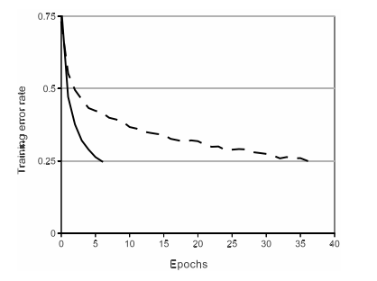
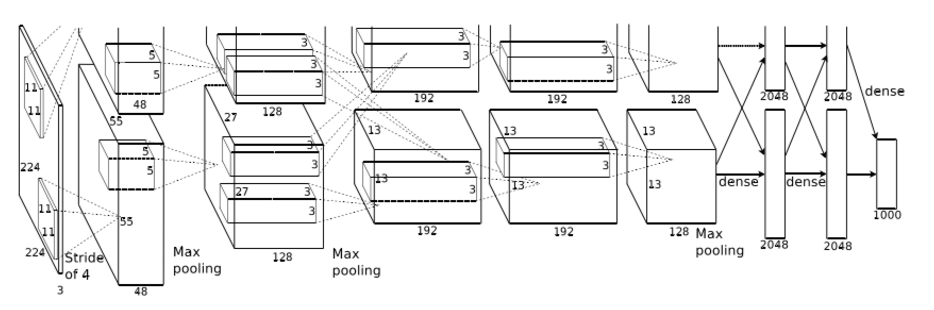

# 论文《4824-imagenet-classification-with-deep-convolutional-neural-networks.pdf》阅读笔记 #
              作者：Alex Krizhevsky 、Ilya Sutskever 、Geoffrey E. Hinton

## 数据库介绍 ##

ImageNet拥有一千多万带标记的高分辨率图片，包含了22000中类别，本论文就是基于该数据库中的120万张图，包含50000个验证图和150000个测试图，并参加了ILSVRC-2012 的比赛，获得了比较好的结果。
该比赛比较重要的两个指标，top-1 和 top-5 错误率。
 1. **top-1**：图像实际类别不是预测的结果中分数最高的一个的错误率。
 2. **top-5**：图像实际类别不在预测结果前5中的错误率。

## 模型框架 ##

 包含了8个学习层，其中5个卷积层、3个全连接层。

 1. 非线性函数 ReLU
 一般神经元激活函数会采用 或者 
 就梯度下降训练时间而言，这些饱和函数要不不饱和函数  
 慢得多。 而训练带 ReLUs 的深度卷积神经网络比带 tanh 的要快好几倍。下图显示了在同一数据库上达到同一精度所需要的训练次数对比：

 **epoch**:使用整个训练样本集传播一次，一次传播=一次前向传播 +一次后向传播。但是考虑内存不够用的问题，训练样本们往往并不是全部都一起拿到内存中去训练，而是一次拿一个ｐａｔｃｈ去训练，一个ｐａｔｃｈ半酣的样本数称为ｐａｔｃｈ　ｓｉｚｅ。
 **iteration**: 使用 patch size 个样本传播一次，同样，一次传播=一次前向传播+一次后向传播。
 比如，我们有1000个训练样本， patch size为100，那么完成一次 epoch 就需要10个iteration。

 2.局部响应归一化

 由于 ReLU 具有一些特性，不需要输入归一化来防止他们达到饱和，但是下面的局部归一化任然有助于模型的泛化。

 需要在某些层应用 ReLU 归一化后再应用这种归一化。

 3. Pooling

 一个pooling层可以被认为是由间隔 s 像素的pooling单元网格组成。

 4. 总体结构

 如图：
 

 主要展示了5个卷积层和3个全连接层，注意每一层都被分成两个两部分在两个GPU上允许，且中间步骤需要两个GPU之间的交互。

 5. 减少过拟合

 **数据增强**：扩大数据集，原始数据是256*256大小，我们随机切片成224*224大小，以及切片后的水平反射，用来增大训练样本量。
 **Dropout**：以0.5的概率将每个隐层神经元的输出设置为零。

 6. 结果
