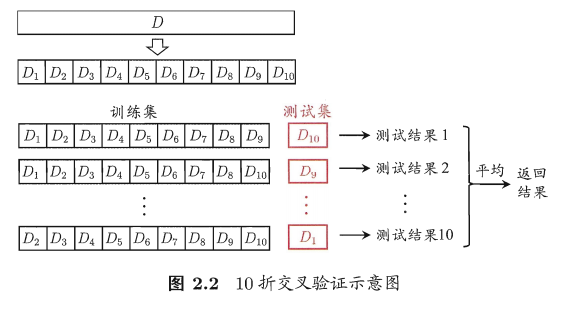
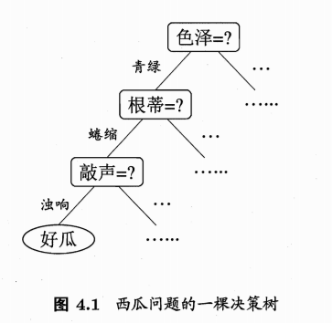
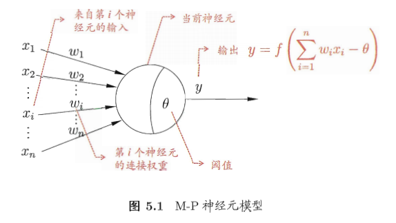
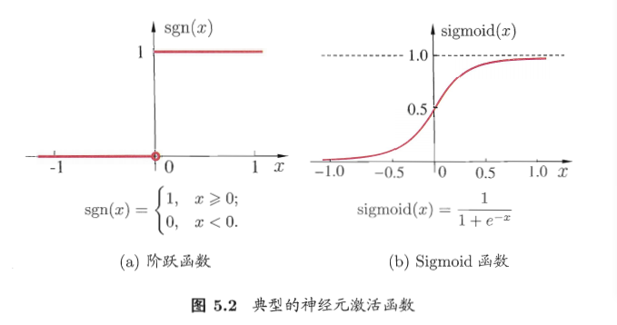
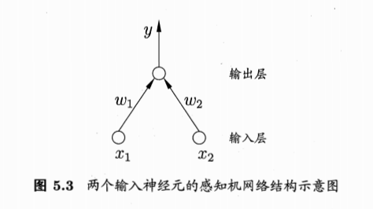
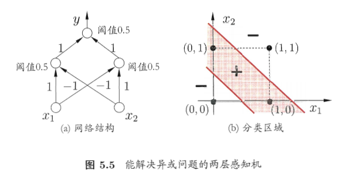
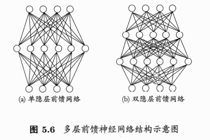

# 周志华《机器学习》——学习笔记 #

----------
[TOC]

## 前言 ##

### 网上摘录的一些概念性的东西 ###

 * **机器学习**：机器学习 (Machine Learning) 是近 20 多年兴起的一门多领域交叉学科，涉及概率论、统计学、逼近论、凸分析、算法复杂度理论等多门学科。机器学习理论主要是设计和分析一些让计算机可以自动学习的算法。机器学习算法是一类从数据中自动分析获得规律，并利用规律对未知数据进行预测的算法。因为学习算法中涉及了大量的统计学理论，机器学习与统计推断学联系尤为密切，也被称为统计学习理论。在算法设计方面，机器学习理论关注可以实现的、行之有效的学习算法。很多相关问题的算法复杂度较高，而且很难找到固有的规律，所以部分的机器学习研究是开发容易处理的近似算法。机器学习在数据挖掘、计算机视觉、自然语言处理、生物特征识别、搜索引擎、医学诊断、检测信用卡欺诈、证券市场分析、DNA 序列测序、语言与手写识别、战略游戏与机器人运用等领域有着十分广泛的应用。它无疑是当前数据分析领域的一个热点内容。

### 算法分类 ###

机器学习的算法繁多，其中很多算法是一类算法，而有些算法又是从其他算法中衍生出来的，因此我们可以按照不同的角度将其分类。本文主要通过**学习方式**和**算法类似性**这两个角度将机器学习算法进行分类。

 1. 学习方式
  * **监督学习**：从给定的训练数据集中学习出一个函数，当新的数据到来时，可以根据这个函数预测结果。监督学习的训练集需要包括输入和输出，也可以说是特征和目标。训练集中的目标是由人标注的。常见的监督式学习算法包括**回归分析**和**统计分类**。
  * **非监督学习**：与监督学习相比，训练集没有人为标注的结果。常见的非监督式学习算法有**聚类**。
  * **半监督学习**：输入数据部分被标识，部分没有被标识，介于监督式学习与非监督式学习之间。常见的半监督式学习算法有**支持向量机**。
  * **强化学习**：在这种学习模式下，输入数据作为对模型的反馈，不像监督模型那样，输入数据仅仅是作为一个检查模型对错的方式，在强化学习下，输入数据直接反馈到模型，模型必须对此立刻作出调整。常见的强化学习算法有时间差学习。

 2.算法类似性
  * **决策树学习**：根据数据的属性采用树状结构建立决策模型。决策树模型常常用来解决**分类和回归**问题。常见的算法包括 CART (Classification And Regression Tree)、ID3、C4.5、随机森林 (Random Forest) 等。
  * **回归算法**：试图采用对误差的衡量来探索变量之间的关系的一类算法。常见的回归算法包括最小二乘法 (Least Square)、逻辑回归 (Logistic Regression)、逐步式回归 (Stepwise Regression) 等。
  * **聚类算法**：通常按照中心点或者分层的方式对输入数据进行归并。所有的聚类算法都试图找到数据的内在结构，以便按照最大的共同点将数据进行归类。常见的聚类算法包括** K-Means 算法**以及**期望最大化算法** (Expectation Maximization) 等。
  * **人工神经网络**：模拟生物神经网络，是一类模式匹配算法。通常用于解决分类和回归问题。人工神经网络算法包括感知器神经网络 (Perceptron Neural Network) 、反向传递 (Back Propagation) 和**深度学习**等。

## 第一章 概述 ##
1. 若我们预测的是**离散值**，这种学习任务称为**分类**。
2. 若我们预测的是**连续值**，这种学习任务称为**回归**。
3. 只涉及两个类别的为**二分类**：其中一个叫*正类*，一个叫*反类*。
4. 涉及多个类别的为**多分类**。

## 第二章 模型评估与选择 ##
1. **错误率或误差**——分类错误的样本数占样本总数的比例，E = a/m。
2. **精度**——1-错误率。
3. **训练误差、经验误差**——学习器在训练集上的误差。
4. **泛化误差**——学习器在新样本上的误差。
5. **过拟合（overfitting）**——我们训练的目标是让学习器在新样本上的误差也就是泛化误差尽可能的小。但当学习器对训练样本学习得“太好了”，把训练样本自身的一些特点当做了所有潜在样本都具有的一般性质，就会导致泛化性能的下降。**（过拟合是机器学习面临的关键障碍，各类算法都必须带有一些针对过拟合的措施，但是过拟合是无法彻底避免的，能做的只是缓解、减小其风险）**
6. **欠拟合**——对训练样本的一般性质都尚未学好，泛化能力变弱。

### 模型评估方法 ###

通常，我们可通过实验测试来对学习器的泛化误差进行评估并进而做出选择。为此须使用一个**测试集**来测试学习器对新样本的判别能力，然后以测试集上的“测试误差”作为泛化误差的近似。

如何从样本集中分别产生出训练集和测试集，有以下几种方法：

 * **留出法**：从样本集中划分一部分作为测试集，常见做法是将大约 2/3~4/5的样本用于训练，剩余样本用于测试。
 * **交叉验证法**：先将数据集划分为 k 个大小相似的互斥子集，然后每次使用 k-1 个子集的并集作为训练集余下的那个子集作为测试集，这样可以获得 k 组训练/测试集，k 通常取值为10.

 * **自助法**：从样本集中随机选出 m 个样本作为训练集，其中 m 中可能有部分样本是重复的，也就是说从 样本集 D 中选取时，同一个样本可能被多次选中。

 * **调参**：超参数的设置。

## 第三章 线性模型 ##

 * 基本形式：
>

 * 向量形式：
>

### 线性回归 ###

>其中
>

线性回归试图学得一个线性模型预测输入值在模型的左右下其输出值逼近标签值。即学习一个模型：
>     

使得
>

其关键问题就是如何确定 w 和 b？ 核心就是如何衡量 f(x) 与 y 之间的差别。常用的方法是**均方误差**。其对应了**欧几里得距离或者“欧氏距离”**。而基于均方误差最小化来进行模型求解的方法称为**最小二乘法**。在线性回归中，最小二乘法就是试图找到一条直线，试所有样本到直线上的欧式距离之和最小。

### 对数几率回归（logistic regression） ###

上面讨论的线性回归其预测值：
>

是**实值**，而考虑到**二分类**任务，其输出标记是：
>

于是，我们需将实值 z 转化为 0/1 值，最理想的就是**单位阶跃函数**，但是单位阶跃函数不连续，不能求导。于是就有了一定程度上近似单位阶跃函数的近似函数，它单调可微。就是**对数几率函数（logistic）**即**Sigmoid函数**：
>

该函数将输入实数值压缩到0，1之间。

Sigmoid函数带入 z 即可得：
>

若将 y 看着样本 x 最为正例的可能性，则 1-y 是其反例的可能性，两者的比值即为**几率**，反映了 x 作为正例的相对可能性，对几率取对数则得到**对数几率**。

综上，这种方法实际上是利用线性回归模型的预测结果去逼近真实标记的对数几率，因此这个模型称为**对数几率回归**，也就是**逻辑回归**，注意，这里虽然名字叫回归，其实是一种分类学习方法。
逻辑回归不仅预测出“类别”，而是可得到近似的概率预测，这对许多需要利用概率辅助决策的任务很有用。

## 第四章 决策树 ##

如上如所示，决策树即是依次对样本的属性进行测试判断，直到得出最终结论。
一般地，一颗决策树包含一个**根节点**、若干个**内部节点**和若干个**叶节点**。叶节点对应于决策结果，其他每个节点则对应于一个属性测试；每个节点包含的样本集合根据属性测试的结果被划分到子节点中；根节点包含样本全集。从根节点到每个叶节点的路径对应了一个判定测试序列。

### 划分选择 ###

**详见 P75**

决策树本质是对属性依次进行判断，其关键问题就在于先判断哪个属性，后判断哪个属性，也就是划分选择问题。一般而言，随着划分过程的不断进行，我们希望决策树的分支节点所包含的样本可能属于同一类别，即节点的**纯度**越来越高。

 1. 信息熵

 信息熵是度量样本集合纯度最常用的一种指标，假定样本集合 D 中第 k 类样本所占比例为：
 >

 其中**|y|**表示类别数量（表示最终决策结果的类别，如判断西瓜为好瓜还是坏瓜，这里类别就是 2 ）。则 D 的信息熵可以定义为：
 >

 信息熵越小，则 D 的纯度越高。

 2. 信息增益

 假定离散属性 a 有 V 个可能的取值，若使用 a 来对样本集 D 进行划分，则会产生 V 个分支节点，其中第 v 个分支节点包含了 D 中所有在属性 a 上取值为的样本，记为，则我们可以根据信息熵公式计算出的信息熵，再考虑到不同的分支节点所包含的样本数不同，给分支节点赋予权重，即样本数越多的分支节点的影响越大，于是可计算出用属性 a 对样本集 D 进行划分所获得的**信息增益**：
 

 一般而言，信息增益越大，则意味着使用属性 a 来进行划分所获得的纯度提升越大。著名的**ID3**决策树学习算法就是采用信息增益为准则来选择划分属性的。

 3. 剪枝处理

 剪枝是决策树算法对付**过拟合**的主要手段。其基本策略有**预剪枝**和**后剪枝**。预剪枝是指在决策树生成过程中，对每个节点在划分前后进行评估，若当前节点的划分不能带来决策树泛化性能提升，则停止划分并将当前节点标记为叶节点；后剪枝则是先从训练集生成一颗完整的决策树，然后自底向上地对非叶节点进行考察，若该节点对应的子树替换为叶节点能带来决策树泛化性能的提升，则将该子树替换为叶节点。

## 第五章 神经网络 ##

 1. M-P 神经元模型

 

 在这个模型中，神经元接收来自 n 个其他神经元传递过来的输入信号，这些输入信号通过带**权重**的连接进行传递，神经元将这些输入的**总和**与神经元的**阈值**进行比较，然后通过**“激活函数”**处理以产生神经元输出。把许多个这样的神经元按一定的层次结构连接起来，就得到了神经网络。

 其中激活函数理想中就是**阶跃函数**，但是阶跃函数不连续、不光滑，因此实际上常用**Sigmoid**函数作为激活函数，如下图所示：

 

 实际上，我们只需将一个神经网络看着一个包含了许多参数的数学模型，这个模型就是若干个函数例如： 相互**嵌套带入**而得。

 2. 感知机和多次网络

 感知机（Perceptron）由两层神经元组成，如下图所示，输入层接收输入信号后传递给输出层，输出层是 M-P神经元，也叫做阈值逻辑单元。

 

 可以得出，给出适当的 **权重** 和 **阈值**，感知机可以很容易实现**逻辑与、或、非**的功能。
 需要注意的是，感知机只有输出层神经元进行激活函数的处理，即只有一层功能神经元，其学习能力有限。逻辑与、或、非是属于线性可分的问题，而线性不可分的问题如 **逻辑异或** ，利用上图的感知机则不能学习得稳定的权重，不能求得合适解。
 要解决非线性可分的问题，需要考虑使用多层功能神经元，如下图：

 

 如下图所示，每层神经元与下一次神经元全互连，且不存在同层连接，也不存在跨层连接，这样的神经网络称为 **多层前馈神经网络**。

 

 神经网络的学习过程，就是根据训练数据来调整神经元之间的链接权重以及每个神经元的阈值。注意， **前馈** 并意味着网络中信号不能向后传递，而是指网络拓扑结构上不存在环或回路。

 3. 反向传播算法 详见 P101

 即误差逆传播算法（error BackPropagation），简称 BP 算法。迄今为止最成功的神经网络 **学习算法**。通常所说的 “BP网络”一般指使用 BP 算法训练的多层前馈神经网络。

 BP 算法 基于梯度下降，在求输出误差的梯度时，根据链式法则，其求解过程一步一步往前影响，将误差传递到上一层网络。

 注意，**标准 BP 算法** 只是针对某一个样本进行计算的过程，而我们实际训练时，目标是最小化训练集的累积误差，其对应 **累积BP算法**。

 4. 深度学习

 理论来说，参数越多的模型越复杂，容量越大，意味着能够完成更复杂的学习任务。但是一般情况下，复杂模型的训练效率低下，很容易陷入过拟合，因为其学习能力太强，在小数据量下容易学习到一些训练集样本有但是一般样本没有的特点。但是随着云计算、大数据时代的到来，训练数据的大幅增加可以降低过拟合的风险，因此，以深度学习为代表的的复杂模型开始流行。

 为了增加网络的学习能力，增加隐层的数量比增加隐层神经元的数目更加有效，因为其不但增加了拥有激活函数的神经元数目，还增加了激活函数嵌套的层数。

## 第六章 支持向量机 ##
